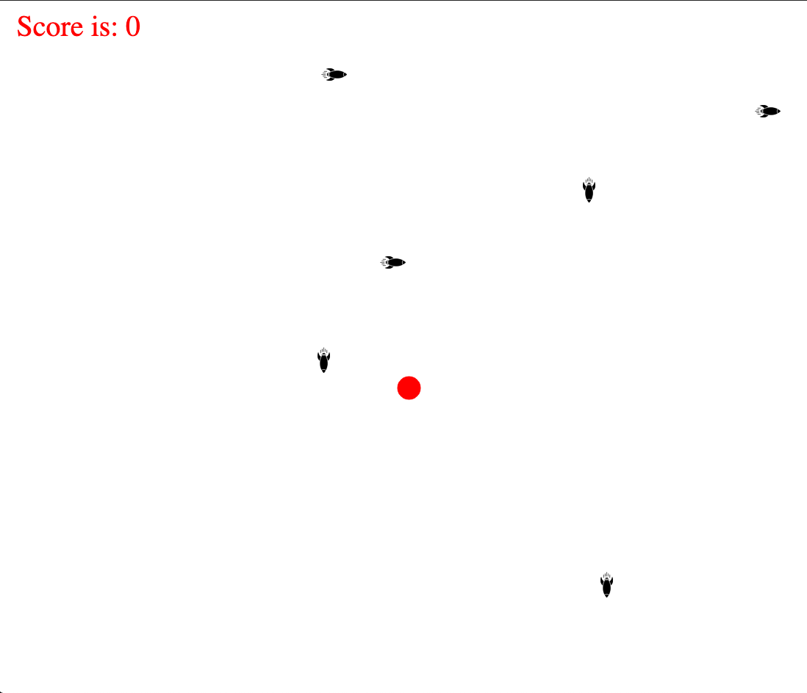

# Case study Object oriented programming

* Start: 09:00 uur
* End: 12:00 uur
* Some students are entitled to have some extra time. They all have 20% extra time, for this exam it is 36 minutes in total. You can hand the answers in until 12.36.
* Tools you are allowed to use: internet, homework assignments and examples from the course. You cannot use social media and you are not allowed to ask any anwers or code from your classmates.
* Ownership: the code you hand-in is written by you.
* You can hand-in your assignment via HZ Learn. Hand-in your project as a zip-file.

## Case

A friend of yours has recently been hired at a software-development company. This company wants to improve its market value by making serious games for students. However, nobody in the company has any experience with the development of games. Therfor they gave your friend the assignment to investigate how game development works and to make a first proof of concept of a game. And it worked! Your fried made a game that the company wants to sell. However there are some features that need to be added, but your friend did not account for this. Every attempt to add another feature to the game has failed.

Luckily you followed the Object Oriented Programming course and you suspect what's wrong. You open the code and your fear becomes reality: almost all the code is packed into one class which means that everything depends on everything. After about half an hour of thinking and drawing you come up with the following design.

Now your friend is calling you in panic: the game has to be finished tomorrow! He promises you half of his salary if you can help. Can you implement the redesign so new features can be added?

## The Game

"Rocket league" is a game in which the player (red circle) tries to avoid rockets. You can control the player using the arrow keys. If the player hits one of the rockets the circle becomes larger.

## Assignment

Rewrite the provided code using the class diagram. Doing this succesfully leads to 1 point for criteria 4 and 6, and 0 points for criterion 8. In other words, your maximum grade will be a 7,0.
You can score the remaining points by adding the following feature:

* Add a powerup to the game. Whenever the player touches the powerup, the circle will shrink (but no further than the starting size!). Use the class diagram below to implement the powerup feature.

ATTENTION: it could happen that during the implementation you make other choices than shown in the class diagram. Your grade will not be lower if your implementation deviates from the class diagram, however your implementation must still meet the criteria listed below.

## Tips

* Take your time. Make small adjustments and test them before you proceed with your next change. This way you are always only one revert (ctrl + z) away from a working version of your code.
* Start by implementing one class.
* Make sure that after implementing your class your code has no errors and works correctly.
* Implement the next class and repeat this until you have all classes.
* The methods in the class diagram have no return type. You will have to add them in your code!
* Constructors, Getters and setters are not added to the class diagram. You have to add them to your code yourself based on the class attributes.

## Hand-in

You always hand-in a zip-file (not a rar or any other kind), which contains your src folder.

## Criteria

Nr | Criteria | Points
--- | --- | ---
1 | student applies indentation consistently for readable and structured code | 0,2
2 | student uses a standardize commenting style according to the AirBnB style guide | 0,4
3 | student naming styles for attributes, method and classes (alongside with variables and functions) is consistent and following the AirBnB style guide. | 0,4
4 | student applies classes (attributes and methods) to structure the code | 2
5 | student applies inheritance to avoid code duplication | 2
6 | student adds types to attributes, parameters, return values explicitly. | 2
7 | student applies encapsulation in a class to hide the data and creates an interface for other objects | 1
8 | student applies polymorphism to avoid redundancy | 1
9 | student applies DRY principles to reduce complexity and stimulate readable and maintainable code parts | 1
