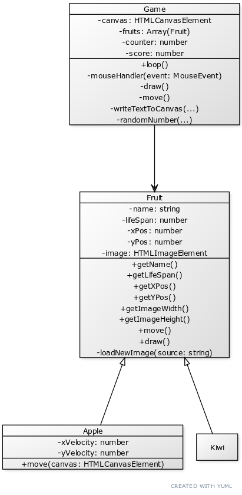

# Casustoets Object oriented programming

* starttijd: 09:00 uur
* eindtijd: 12:00 uur
* Studenten met een faciliteitenpas hebben recht op  20% extra tijd. Dat vertaalt zich voor dit tentamen naar 36 minuten. Deze studenten hebben dus een eindtijd van 12:36.
* hulpmiddelen: internet, huiswerk en voorbeelden uit les. Je mag internet inzetten als een informatiemiddel maar niet als een communicatiemiddel.
* eigenaarschap: de code die je hebt opgeleverd is door jou ontwikkeld.

## Casusomschrijving

In dit spel probeert de speler op een kiwi te klikken voordat de kiwi is verdwenen. Als de speler op een kiwi klikt krijgt hij/zij een punt. Als de speler per ogeluk op een appel klikt dan gaat er een punt van het totaal af.

## Spelregels

* Er is 1 speler
* De kiwis en appels verdwijnen na een aantal seconden.
* Een appel kost 1 punt
* Een kiwi levert 1 punt op
* Als de appels en kiwi zijn verdwenen dan is het spel afgelopen en wordt de uiteindelijk score getoond

## Opdracht

Gegeven is een werkende uitwerking in het bestand app.ts. Merk wel op dat de code werkt, maar dat deze absoluut niet is geoptimaliseerd. Dat moet jij gaan doen. Onder andere door de juiste classes, attrubutes en methods te implementeren gebaseerd op het volgende class diagram.

Succesvol refactoren van de bestaande code naar bovenstaand klassediagram levert maximaal een 6,5 op als eindcijfer. Je kan voor de 10 gaan door een extra regel te implementeren (hints staan al in het diagram):

* De appel beweegt in een willekeurige richting over het scherm (en stuitert van de randen van het canvas)

## Tips

* Neem je tijd. Maak kleine wijzigingen en test ze allemaal voordat je een nieuwe wijziging maakt. Dan ben je altijd een enkele revert (ctrl + z) verwijderd van een werkende versie van je code als er onverwacht iets mis gaat.
* Begin met het implementeren van 1 klasse.
* Zorg er voor dat je code na implementatie van 1 klasse nog werkt en geen errors bevat.
* Implementeer vervolgens een volgende klasse en herhaal tot je alle klasses hebt.
* De methodes in het klassediagram hebben geen return type. Die zul je er dus zelf bij moeten zetten in je code!

## Inleveren

Je levert een zip-bestand in (geen rar oid) met daarin een je src map.

## Beoordelingscriteria

Nr | Leeropbrengsten | Punten
--- | --- | ---
1 | past op een consistente manier indentation in de code toe | 0,2
2 | voorziet de code volgens een standaard afspraak (AirBnB styleguide) code van commentaar | 0,4
3 | geeft consistent betekenisvolle namen aan variabelen, classes en methods (AirBnB styleguide) | 0,4
4 | structureert de code in classes met attributen en methoden | 2
5 | past overerving in de code toe om herhaling (code dublicatie) te voorkomen | 2
6 | geeft types van attributen, parameters en returnwaarden expliciet (any type is niet toegestaan) aan | 2
7 | past encapsulation (private, public or protected) in een class toe zodat data van de class op een goede manier wordt verborgen voor zijn omgeving | 1
8 | past polymorphisme toe opdat code minimaal wordt herhaalt | 1
9 | past de DRY (Don't repeat yourself) principes toe zodat complexiteit van de code goed wordt verdeeld in onderhoudbare onderdelen | 1
